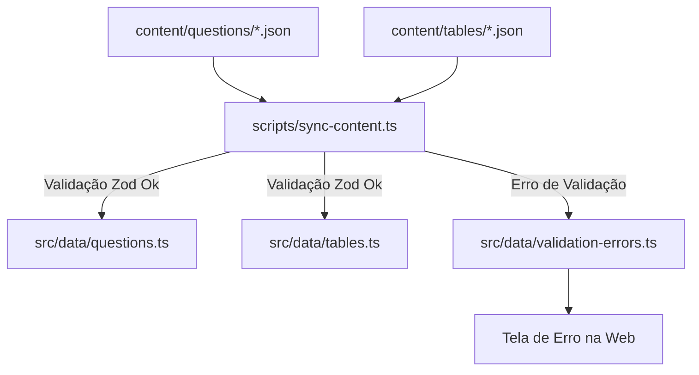

# ⚔️ Guia de Conteúdo: SQL Arena

Este documento serve como guia completo de referência técnica sobre como gerenciar, expandir e integrar novos conteúdos ao **SQL Arena**. Nosso sistema utiliza arquivos JSON de definição de dados desacoplados do código fonte, validados rigorosamente via **Zod** e compilados automaticamente em módulos TypeScript de alta performance.

---

## 🛠️ Visão Geral da Arquitetura

O ecossistema de dados do SQL Arena divide-se em:

1. **`/content` (JSONs de Entrada):** Local onde você edita as perguntas e tabelas do simulador em formato JSON simples.
2. **`scripts/sync-content.ts` (Compilador & Validador):** Script TypeScript que valida a conformidade dos dados com Zod.
3. **`src/data/` (Arquivos Compilados de Produção):** Destino onde o script gera arquivos `.ts` otimizados para consumo direto da aplicação (`questions.ts` e `tables.ts`).
4. **Tela de Diagnóstico de Erro (Overlay):** Mecanismo que exibe um aviso em tela cheia na aplicação se algum JSON estiver corrompido ou fora do padrão Zod.



---

## 📝 1. Adicionando uma Nova Questão

As questões são configuradas na pasta `content/questions/`. Cada questão deve ter seu próprio arquivo JSON (ex: `q10.json`).

### Estrutura do JSON de Questão

O arquivo JSON deve conter os seguintes campos obrigatórios:

| Campo            | Tipo       | Descrição                                                                                                           |
| :--------------- | :--------- | :------------------------------------------------------------------------------------------------------------------ |
| `id`             | `number`   | ID inteiro positivo único da questão (usado para ordenação no mapa de desafios).                                    |
| `title`          | `string`   | Título curto e descritivo da questão.                                                                               |
| `description`    | `string`   | Enunciado explicando o que o aluno deve obter na consulta SQL.                                                      |
| `difficulty`     | `string`   | Dificuldade da questão. Deve ser exatamente `"Fácil"`, `"Médio"` ou `"Difícil"`.                                    |
| `expectedQuery`  | `string`   | A consulta SQL de referência usada para conferir e comparar a resposta do aluno.                                    |
| `placeholderSql` | `string`   | O código SQL inicial exibido no editor (geralmente comentários ou instruções básicas).                              |
| `hints`          | `string[]` | Array de dicas de apoio graduais (pistas exibidas consecutivamente no card de dicas). Deve conter no mínimo 1 dica. |

### Exemplo Prático (`content/questions/q10.json`)

```json
{
  "id": 10,
  "title": "Produtos Acima da Média",
  "description": "Selecione o nome e o preço de todos os produtos cujo preço é estritamente superior à média de preço de todos os produtos cadastrados.",
  "difficulty": "Médio",
  "expectedQuery": "SELECT nome, preco FROM produtos WHERE preco > (SELECT AVG(preco) FROM produtos)",
  "placeholderSql": "-- Use subconsultas com AVG()\nSELECT nome, preco FROM produtos WHERE preco >",
  "hints": [
    "A função AVG(preco) calcula a média de todos os preços.",
    "Utilize uma subconsulta (nested query) para obter o valor da média.",
    "A consulta interna fica entre parênteses: (SELECT AVG(preco) FROM produtos)."
  ]
}
```

---

## 📊 2. Adicionando uma Nova Tabela

As tabelas do banco de dados relacional simulado são configuradas na pasta `content/tables/`. Cada tabela deve ter seu próprio arquivo JSON (ex: `categorias.json`).

### Estrutura do JSON de Tabela

O arquivo JSON de tabela integra tanto o esquema estrutural das colunas quanto a carga de dados simulados (mock data):

| Campo     | Tipo     | Descrição                                                                                                                                         |
| :-------- | :------- | :------------------------------------------------------------------------------------------------------------------------------------------------ |
| `name`    | `string` | Nome físico da tabela. Deve ser em `snake_case` (letras minúsculas e sem acentos).                                                                |
| `columns` | `array`  | Lista de colunas contendo `name` (nome em snake_case), `type` (tipo do dado ex: `VARCHAR`, `INT`) e `description` (para o navegador de esquemas). |
| `data`    | `array`  | Linhas de registros simulados. Cada linha é um objeto chave-valor onde as chaves correspondem aos nomes das colunas.                              |

### Exemplo Prático (`content/tables/categorias.json`)

```json
{
  "name": "categorias",
  "columns": [
    {
      "name": "id",
      "type": "INT",
      "description": "Identificador único e incremental da categoria"
    },
    {
      "name": "nome",
      "type": "VARCHAR(100)",
      "description": "Nome descritivo da categoria de produtos"
    }
  ],
  "data": [
    { "id": 1, "nome": "Eletrônicos" },
    { "id": 2, "nome": "Eletrodomésticos" },
    { "id": 3, "nome": "Móveis e Decoração" }
  ]
}
```

---

## 🔄 3. Sincronizando o Conteúdo

Depois de criar ou editar qualquer arquivo JSON dentro de `content/questions` ou `content/tables`, você precisa rodar o script de sincronização para validar as informações e aplicar as mudanças na interface.

Execute o comando no terminal do projeto:

```bash
pnpm sync-content
```

### O que acontece quando você roda o comando?

1. **Validação Rígida (Zod):** O script lê todos os JSONs e valida cada campo em relação aos esquemas declarados. Ele verifica regras como:
   - Nomes de tabelas e colunas com caracteres inválidos.
   - Dificuldades incorretas.
   - Falta de campos obrigatórios.
2. **Caminho Feliz (Sucesso):**
   Se todos os dados forem válidos, ele gerará os arquivos de produção e limpará o log de erros:
   - 📝 `src/data/questions.ts`
   - 📝 `src/data/tables.ts`
   - 📝 `src/data/validation-errors.ts` (limpo com `[]`)
   - A aplicação web será recarregada automaticamente (HMR) e exibirá as atualizações de imediato!
3. **Caminho de Erro (Falha):**
   Se houver qualquer violação estrutural ou sintática nos JSONs, o terminal exibirá o diagnóstico detalhado e escreverá os erros no módulo de interface `src/data/validation-errors.ts`.

---

## 🛑 4. Lidando com Erros de Validação

Caso você escreva alguma propriedade incorreta, a aplicação web exibirá automaticamente uma **tela vermelha em tela cheia (Overlay de Erro)** contendo:

- O nome exato do arquivo que causou o problema.
- O caminho do campo violado (ex: `columns.2.name`).
- Uma mensagem descritiva explicativa para te ajudar a consertar o erro.

> [!TIP]
> **Como resolver um erro na interface:**
>
> 1. Abra o arquivo JSON indicado e corrija o valor fora do padrão.
> 2. Execute `pnpm sync-content` no terminal para compilar novamente.
> 3. O erro desaparecerá da tela e a aplicação principal voltará a funcionar instantaneamente!
